# Bruno Santos

Software Engineer delivering backend-heavy systems and complete product flows.
Strong background in Python, Node.js, TypeScript and Go, building products end-to-end with focus on reliability, integrations and operability.

Most of my work is backend-heavy, but I regularly deliver complete product flows — from backend services and async pipelines to frontend interfaces and deployment. I optimize for systems that can be understood, debugged and evolved by other engineers.

---

## What I actually work on

- Backend services and APIs with clear contracts and predictable behavior
- Async processing with workers, queues and schedulers for sync, enrichment and long-running workflows
- Integrations with unstable or legacy systems, designed with retries, backoff, idempotency and rate limits
- Data modeling and performance on PostgreSQL, Redis and Supabase
- Product-facing flows and internal tools using React and Next.js when full ownership is required
- Operational concerns: logs, metrics, tracing, incident response and post-mortems
- LLM-enabled automation constrained by schemas, auditability and cost control

---

## Selected projects

These projects reflect full product ownership, combining backend systems, async processing and user-facing flows.

- **FAMATH Enrollment Ecosystem**
  End-to-end academic enrollment platform with admin backoffice, candidate portal, WhatsApp LLM agent, payments and legacy system synchronization. Designed async ingestion to avoid timeouts and ensure continuity of the enrollment flow.

- **Fintech CRM with AI Lead Qualification**
  CRM platform with WhatsApp ingestion, LLM-driven lead qualification, stage-based pipelines, round-robin assignment, and real-time Kanban updates via WebSockets.

- **Multi-tenant DRE Engine**
  Financial platform with rule versioning, consistency guarantees and tenant isolation, focused on correctness, auditability and historical integrity.

- **OpsForge** (public, in progress)
  Observability and webhook delivery platform focused on reliable event delivery, retries with exponential backoff, multi-tenant isolation and operational visibility.

Case studies and representative snippets:
https://github.com/Bruno-Alvez/real-use-cases

Some production repositories are private due to company and client constraints. Public case studies focus on architecture decisions, trade-offs and real production patterns.

---

## Tech stack

**Languages**
Python, Node.js, TypeScript, Go

**Backend & APIs**
FastAPI, Django REST Framework, Fastify, Express, REST APIs

**Frontend**
React, Next.js, TailwindCSS

**Data & Infra**
PostgreSQL, Redis, Supabase, AWS, Docker, CI/CD

**Observability**
OpenTelemetry, Prometheus, Grafana

---

## Infrastructure & Ops

---

## Metrics

<picture>
  <source media="(prefers-color-scheme: dark)" srcset="github-metrics.svg" />
  
</picture>

Contribution radar & habits

 

Achievements

 

---

## Contact

- Email: bruno.bsantos75@gmail.com
- LinkedIn: https://linkedin.com/in/brunoalves-tech
